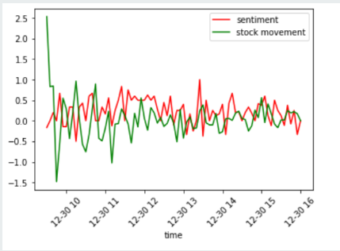
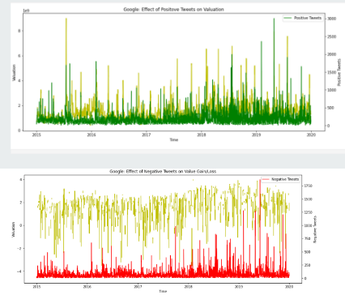
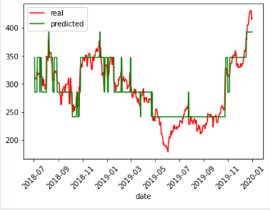
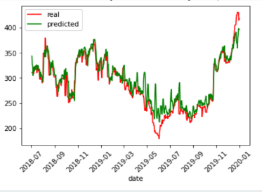

# Stock-Prediction-using-Tweets

This projects attempts to figure out if there exists a correlation between twitter sentiment and stock price movement.
We have chosen 5 companies :-   
- Apple   
- Tesla   
- Google   
- Microsoft   
- Amazon

### How did we do it?
We began with Sentiment Analysis of tweets. This was carried out using the following approaches:
- Naive Bayes
- Deep Learning LSTM
- Pre-Trained Rule-Based VADER Models
- Transformers(BERT)

After obtaining the sentiment , we performed minute wise analysis by grouping the tweets into intervals of 5 mins.We could not detect a strong correlation between stock price and tweet sentiment.

We then incorporated trend_score which considers tweet volume , tweet retreats and tweets.We also increased the time interval and performed day wise analysis.
We concluded that most of the tweets of a company is neutral and positive tweets tend to have a positive correlation with company valuation and change in price.Negative tweets generally don’t show strong correlation trends with the change in price.

Next we neglected neutral tweets and got the sentiment scores. We made use of trend score and  daily tweet volume in order to get better results.
Using the below mentioned models, we attempted to predict the Stock closing price of that day.

- Random Forest Regressor - got accuracy 80.5%

Support Vector Regressor - got accuracy 86.4%

**Hence we can conclude that, sentiments and tweet volume have an impact on fluctuations of the stock price. So we can consider it as a factor while predicting the stock price.**

> Made by Sanchit Garg

